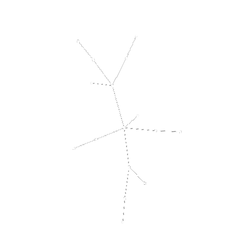

# Feasible Edge Replacements - Class and Algorithms

## About

<table>
<tr>
<td>
This repo contains four things:

- A class for `Fer` objects in **feasible_edge_replacement.py**.
- Some general methods for the study of amoeba graphs in **amoebas.py**. In particular, a method for finding `Fer` generators (called `updating_Cayley_populate`), something that is referenced but left out of [1].
- An implementation of the algorithm of [1] in **main.py**.
- A construction of a recursive family of amoebas to apply the algorithm to, for illustrative purposes, in **treebonacci.py**.

</td>
<td>

</td>
</tr>
</table>

Every `Fer` object has two attributes: a sequence of feasible edge replacements and its corresponding permutation. The length of a sequence can be obtained by `len(fer)`. The product `*` of two `Fer` objects multiplies their permutations and concatenates the edge replacements, updating the labels. 
> Note that products are written **left-to-right**, in contrast with traditional algebraic notation. 

The algorithm produces a hash map that links every permutation in a generating set of the symmetric group to a `Fer` object.

## Mathematical background

Let $G$ be a graph and $e$ an edge of $G$. We say $(e\to g)$ is a *feasible edge replacement* (`Fer`, for short) if $G-e+g$ is isomorphic to $G$. We say a graph is an *amoeba* is it can be transformed into any isomorphic copy of itself by means of a sequence of `Fer` objects. For more details on amoebas and the difference between *local* and *global* amoebas, consult [2].

This repo offers a class for `Fer` objects to study amoebas. Relevant operations are defined for these objects. This class is extensively used in the algorithms presented below.

In the paper [1], it is proved that a certain recursive family of graphs are all amoebas. In this repo, we give an implementation of the algorithm decribed in Section 5 that will factor any permutation of a *stem-symmetric* (see Definition 6 of [1]) amoeba into `Fer` objects in time $\Theta(n^2)$, where $n$ is the order of the graph. This succesfully provides an efficient method of finding, for any isomorphic copy of the amoeba, a sequence of replacements that will move the graph into its copy.

Furthermore, this repo contains a construction of one such type of recursive family, called Fibonacci-type trees in [1], to serve as an illustrative example of the algorithm.

## Instructions

To use the algorithm, we need to provide a stem-symmetric recursive construction similar to the one given in Theorem 8 of [1]. One such example is provided in **treebonacci.py**.

Here is a minimal working example on how to use the main features of this repo:

1. Download the folder and leave all Python scripts in the same working directory.
2. Install all dependencies.
3. Open **main.py** in your favorite editor and provide an input for `k` and `permutation`. Default is $k=6$ and random.
4. Output will be the sought sequence.
5. To verify the `Fer` objects, use `fer_verifier` in **amoebas.py**.
6. To change the family of graphs, change line 8 `import treebonacci as trb` and provide a valid stem-symmetric recursive amoeba family. Note you may need to use the methods in **amoebas.py** to regenerate the basis objects.
7. To animate the edge-replacements, wait for me to upload the animation module.

---

### This program was developed by

- Tonatiuh Matos Wiederhold 
  Dept. of Mathematics, University of Toronto, Canada. 
  tonamatos@gmail.com

Based on the research of [1], below.

## References

[1] <a href="http://arxiv.org/abs/2311.17182">Eslava, L., Hansberg, A., _, Ventura, D., *New recursive constructions of amoebas and their balancing number*, **preprint**, 2023.</a> 

[2] <a href="https://www.combinatorics.org/ojs/index.php/eljc/article/download/v30i3p9/pdf/">Caro, Y., Hansberg, A., Montejano, A. (2023). *Graphs isomorphisms under edge-replacements and the family of amoebas*. **Electronic Journal of Combinatorics 30(3) P3.9**</a> 
